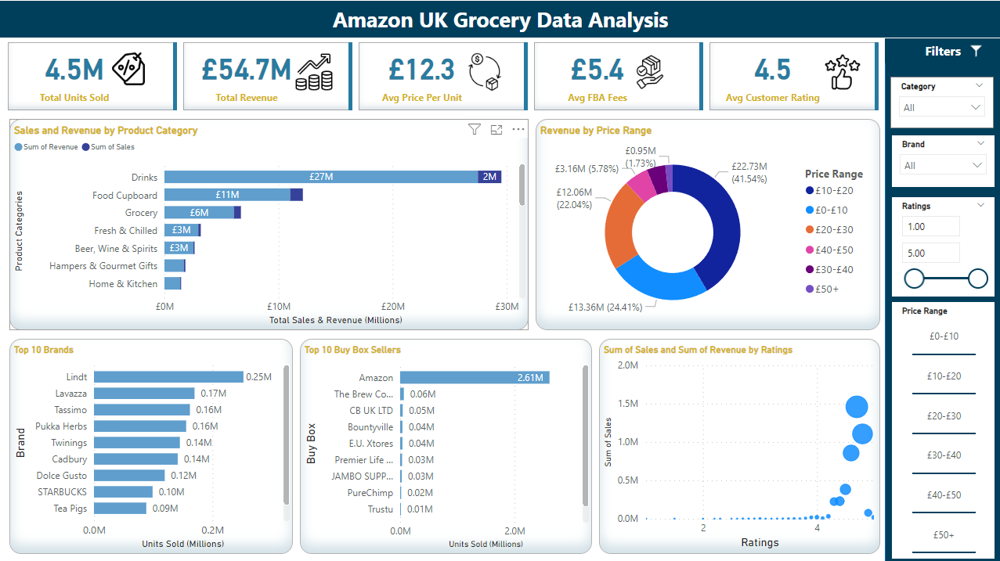

# Amazon UK Grocery Sales Analysis PowerBi Dashboard
## Introduction
This project analyzes the performance of products in the Amazon UK Grocery category using an interactive, multi-page Power BI dashboard. It provides a comprehensive view of key business metrics such as sales, revenue, pricing trends, and product performance across various categories. By leveraging rich visualisations, the dashboard empowers stakeholders to uncover meaningful insights and make informed decisions. Whether optimizing inventory, refining pricing strategies, or evaluating product success, this tool equips decision-makers with the data needed to drive growth and efficiency in a competitive marketplace.
## Source of Data
The dataset is publicly available on Kaggle, providing an extensive overview of Amazon grocery products. It captures key statistics such as sales, revenue, product ratings, Best Seller Rank (BSR), and more, collected through the Helium10 tool. This rich dataset allows for in-depth analysis across multiple product categories and brands.
## Data Preprocessing

### Page 1: Sales and Revenue Overview
This page serves as the high-level overview of the Amazon UK Grocery products, summarizing the key performance indicators (KPIs) such as total sales, total revenue, and best-performing categories. It helps answer the following key questions:

- Which categories are generating and revenue?
- How do different product brands perform across these categories?
- What are the sales trends across different price ranges?
- How do product ratings influence sales?
  

