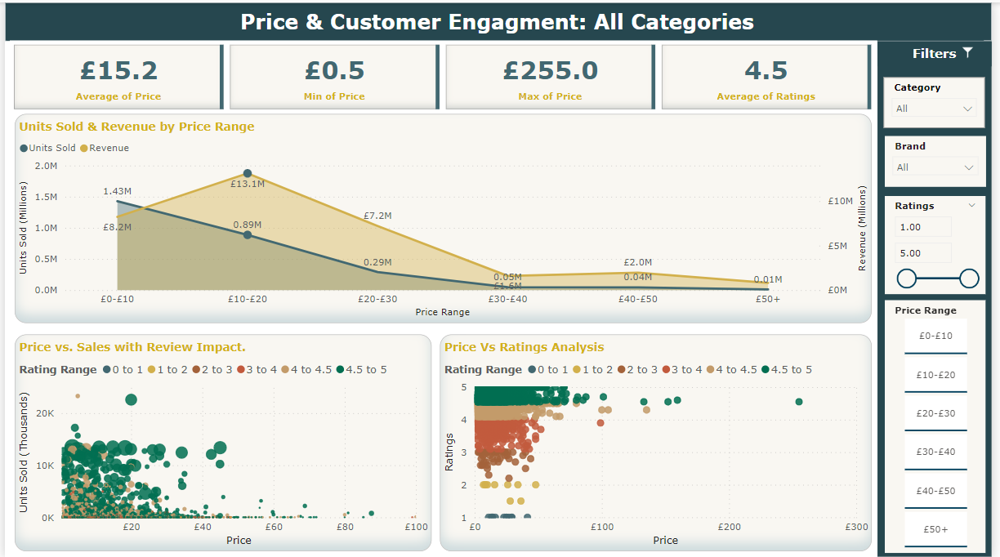

# Amazon UK Grocery Sales Analysis PowerBi Dashboard
## Introduction
This project analyzes the performance of products in the Amazon UK Grocery category using an interactive, multi-page Power BI dashboard. It provides a comprehensive view of key business metrics such as sales, revenue, pricing trends, and product performance across various categories. By leveraging rich visualisations, the dashboard empowers stakeholders to uncover meaningful insights and make informed decisions. Whether optimizing inventory, refining pricing strategies, or evaluating product success, this tool equips decision-makers with the data needed to drive growth and efficiency in a competitive marketplace.
## Source of Data
The dataset is publicly available on Kaggle, providing an extensive overview of Amazon grocery products. It captures key statistics such as sales, revenue, product ratings, Best Seller Rank (BSR), and more, collected through the Helium10 tool. This rich dataset allows for in-depth analysis across multiple product categories and brands. 
## Data Preprocessing
For this dashboard project, data preprocessing was performed in Python to ensure clean, reliable data. This included handling null values, standardizing brand and category entries, and using NLP techniques like fuzzy matching with FuzzyWuzzy to correct brand name inconsistencies. You can access the Python Jupyter Notebook file used for data preprocessing by [clicking here](./Data_Preprocessing).

## Overview of Dashboard Features
This multi-page dashboard provides an in-depth analysis of key metrics related to the Amazon UK Grocery category. Below are the summaries for each dashboard page:

### Page 1: Sales and Revenue Overview
This page serves as a high-level overview of Amazon UK Grocery products, highlighting essential KPIs such as total sales, total revenue, and top-performing categories. It provides clear answers to key business questions, empowering users to make data-driven decisions:

- Which product categories drive the highest revenue?
- How do specific brands perform within these categories?
- What trends emerge across different price ranges?
- Which brands and products consistently receive high ratings and positive reviews?

This overview allows stakeholders to quickly gauge product and brand performance, evaluate price-driven trends, and identify customer-preferred products, making it a valuable tool for strategic planning and market analysis.

  

### Page 2: Price and Customer Engagement Analysis
This page provides an in-depth analysis of pricing dynamics and customer engagement for Amazon UK Grocery products. By examining the impact of price on sales and customer sentiment, it answers critical questions to guide pricing strategies and customer-focused decisions:
- How do different price points influence sales and overall revenue?
- What is the relationship between product pricing and customer engagement?
- How does customer feedback vary across price tiers?

With a combination of KPI cards and interactive visualizations, this dashboard enables stakeholders to make informed pricing decisions, refine customer engagement strategies, and ultimately enhance product positioning in the market.

---
**Note**: This dataset offers extensive potential for further analysis, and I am actively exploring additional ways to expand the scope of this Power BI dashboard. As I continue to uncover new insights, the dashboard will be updated to provide even more comprehensive views of Amazon UK Grocery product performance and trends.
